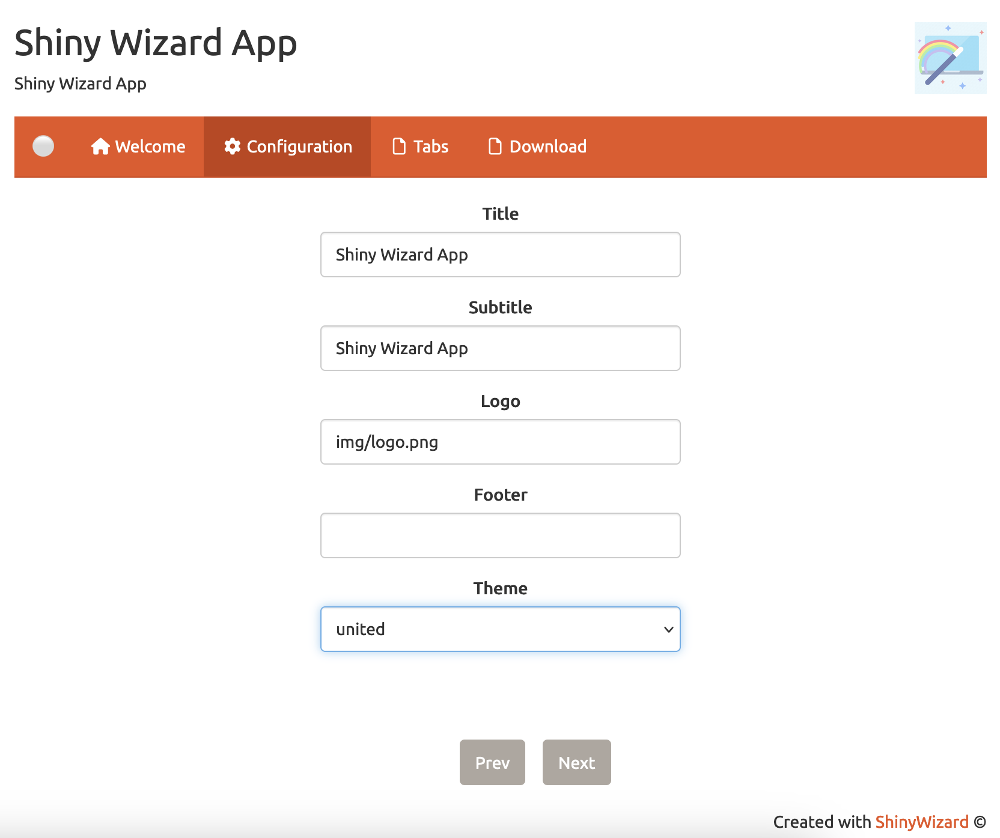
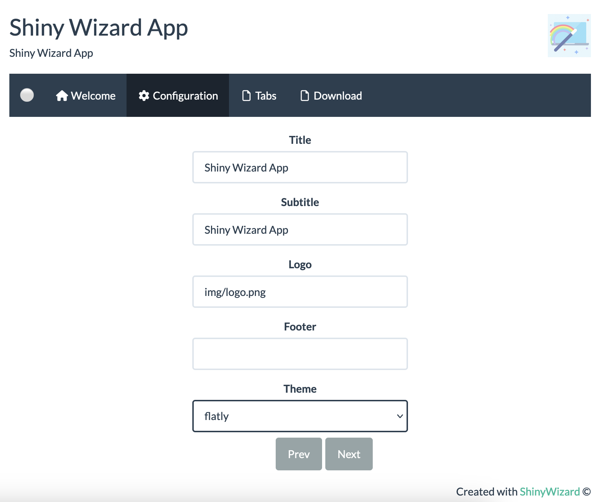
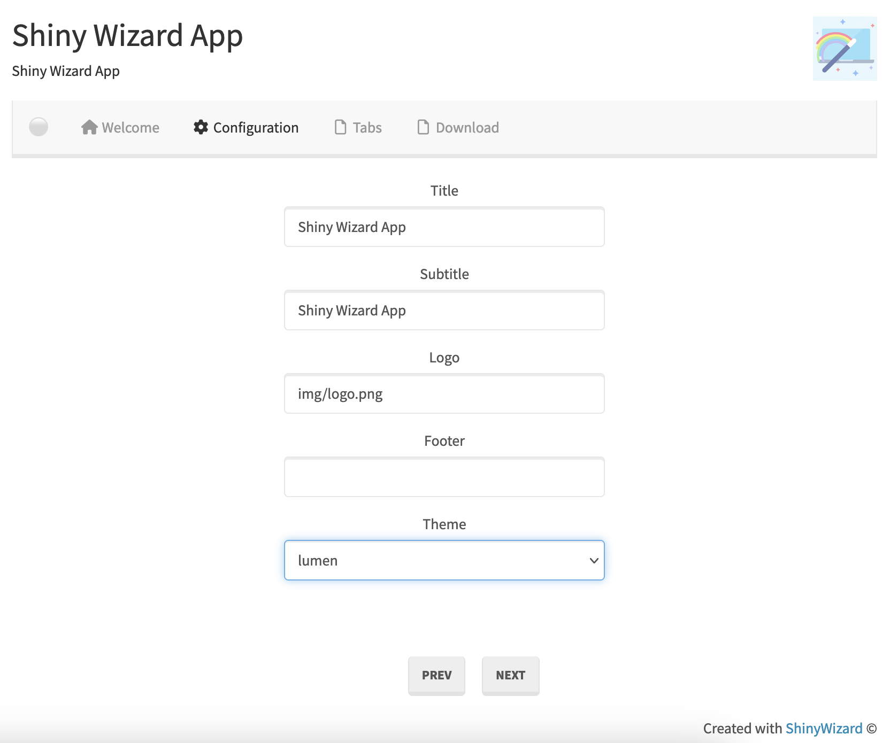
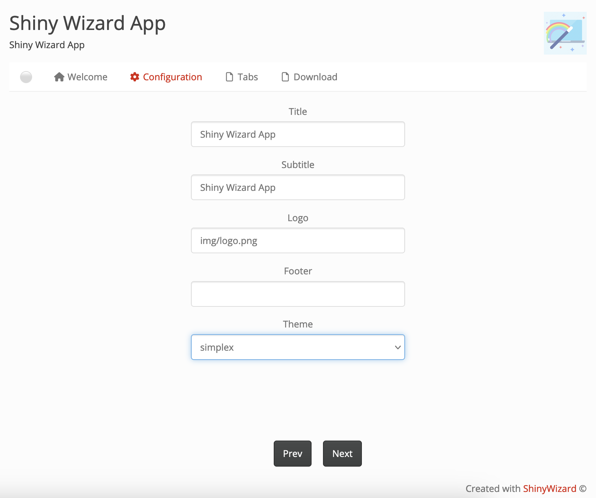

# ShinyWizard 
          


# kmeRs: K-mers Similarity Score Matrix and HeatMap

<table width="100%" border="0">
  <tbody><tr>
    <td width="80%">ShinyWizard is a <b>Shiny App</b> to build an <b>interactive DEMO presentations</b> for any R package. 
    
    ShinyWizard installs and runs as an standard R package.</td>
    <td width="20%"></td>
  </tr>
</tbody></table>

## Quick Run 

```r
devtools::install_github("urniaz/ShinyWizard", ref="package", force = TRUE)
library("ShinyWizard")
ShinyWizard::RunShinyWizard()
```

## Quick Examples   =>  [Examples](#22-examples)


[1. Installation](#1-installation)

[2. Documentation](#2-documentation)
- [2.1 Functions](#21-functions)
- [2.2 Examples](#22-examples)
- [2.3 Tutorials](#23-tutorials)
    
[3. Tests](#3-tests)

[4. How to cite](#4-how-to-cite)

[5. Acknowledgement](#5-acknowledgement)

[6. References](#6-references)


## 1. Installation

## Install 

```r
devtools::install_github("urniaz/ShinyWizard", ref="package", force = TRUE)
library("ShinyWizard")
```
## Run App

```r
ShinyWizard::RunShinyWizard()
```

## 2. Documentation

### 2.1 Functions
The documentation for package including user guides, package vignettes, descriptions of the functions and other documentation is simply accessible by running command below.

```r
# To show the manual and functions' descriptions 
help(package = "ShinyWizard")
```

### 2.2 Examples

   

### 2.3 Tutorials

TBA


## 3. Tests

Test are implemented as *continuous integration* by CircleCI. Continuous integration is a DevOps software development practice where code changes are regularly merge into a central repository, after which automated builds and tests are run.

The *source* of tests covering the code of the package are available in [tests](https://github.com/urniaz/ShinyWizard/blob/master/tests) folder of the repository.


## 4. How to cite

TBA


## 5. Acknowledgement

TBA


## 6. References

TBA
